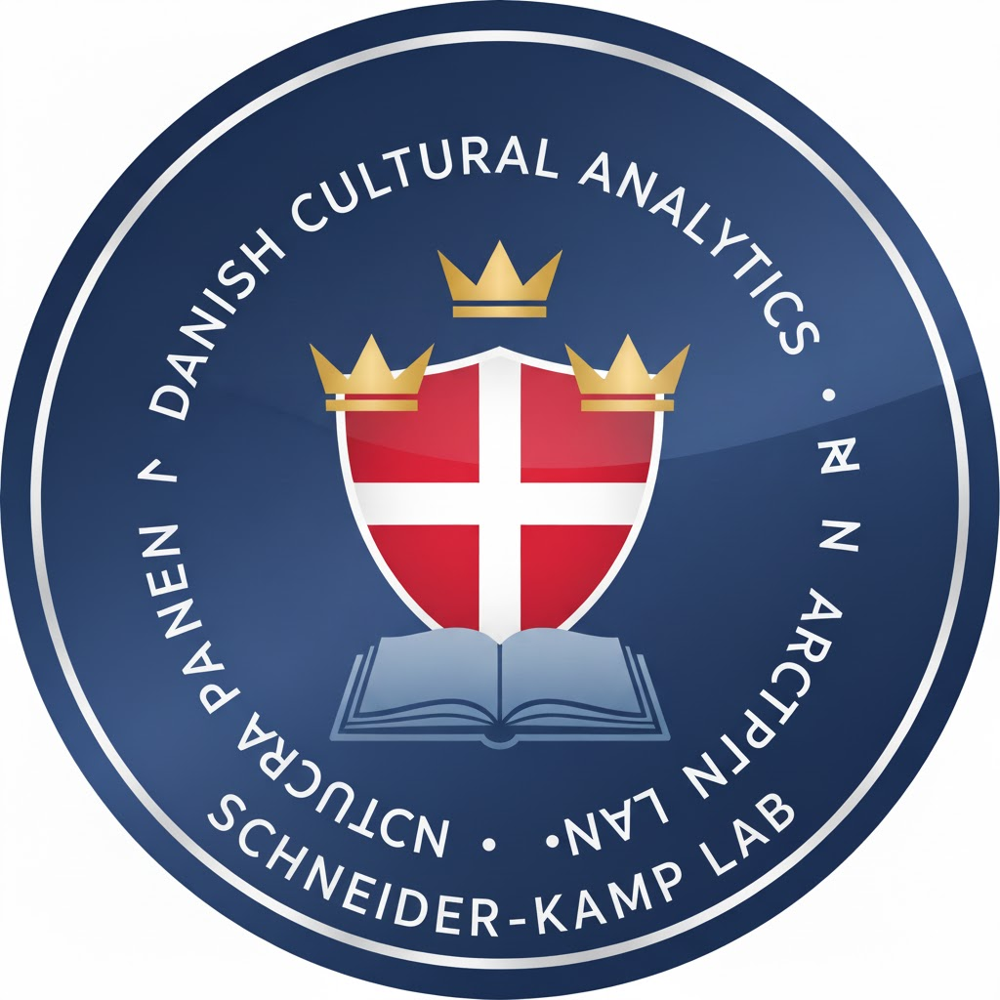

# 🇩🇰 SDU-Culture-1: Evaluating LLM Knowledge of Danish Culture  

  

**SDU-Culture-1** is the first version of a dataset designed to **evaluate large language models’ understanding of Danish culture**, as defined by the official **Danish Culture Canon (Kulturkanon, 2006)**, defined by 756 closed question-answer pairs.  

The Canon highlights 108 works across literature, music, visual arts, architecture, design, film, and performing arts. These works form a curated benchmark of what is often considered Denmark’s cultural heritage. By using them as anchors, this dataset enables systematic investigation of how well LLMs can reason about, contextualize, and generate insights into Danish culture.  

---

## Why this dataset?  

- **Cultural Relevance Test** – The Canon provides a well-defined cultural benchmark for evaluation.  
- **Knowledge Probing** – Randomized prompts (Danish "*stikprøvekontrol*) test both relevant and less relevant associations with Canon works.
- **Human Validation** – Every generated question/response pair is annotated for validation and relevance, even though we both want to main- and non-mainstream knowledge. 

---

## Methodology  

1. **Sampling (*Stikprøvekontrol*)**  
   For each Canon title, random questions are generated — ranging from directly relevant inquiries (e.g., about historical context) to more peripheral or unexpected ones.  

2. **Response Collection**  
   LLMs provide answers to these questions, creating a structured dataset of outputs.  

3. **Human Evaluation**  
   - **Relevance** (on-topic vs. off-topic)  
   - **Accuracy** (correct vs. incorrect)  
   - **Cultural Insight** (does it capture nuance/meaning? - also including small or even niece facts)  

---

## Applications 

- Benchmarking **LLM performance on Danish culturally sub-domains**  
- Supporting **digital humanities research** on how AI engages with cultural canons  
- Encouraging critical reflection on the **boundaries of cultural knowledge** encoded in AI systems  

---

# SDU-Culture-1
